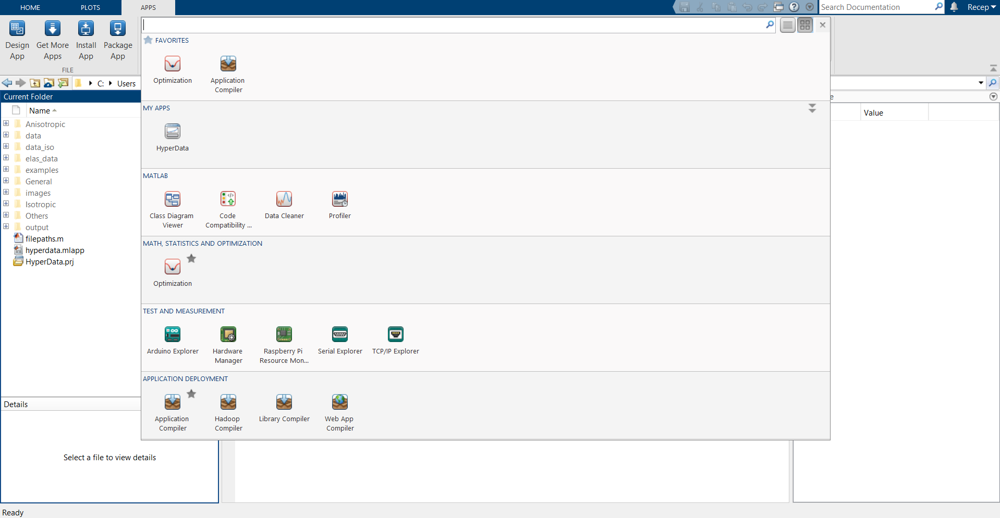
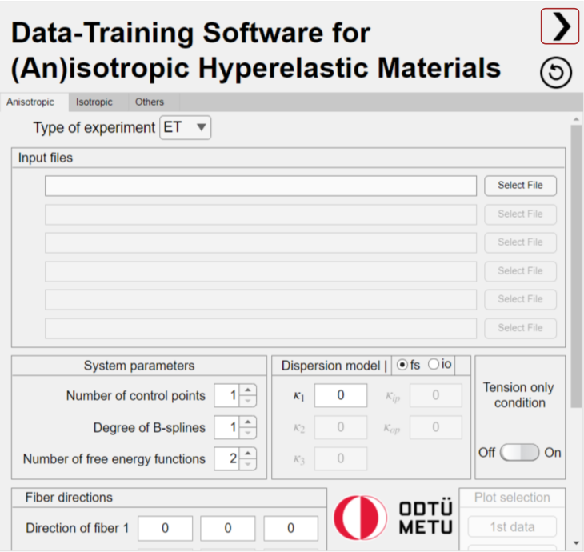
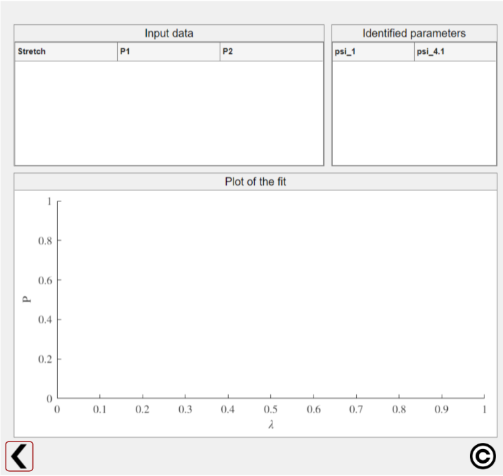

# Hyper-Data: A MATLAB based optimization software for data-driven hyperelasticity
This repository is designed for more information about the Hyper-Data software presented in the relevant [SoftwareX article](). Hyper-Data software is a parameter identification toolbox for the data-driven frameworks proposed by Dal et al.[^1], and Açan et al.[^2]. 

**NOTE:** Please cite Dal et al.[^1][^3][^4], and Açan et al.[^2] in any work that benefits from this software.

## Installation

First of all, make sure to have at least MATLAB R2022a, older versions are not tested. Download, and run "HyperData.mlappinstall" in MATLAB. After the installation, the application must appear in MATLAB under Apps tab and My Apps section as shown.



## Instructions 
For the interface, high screen resolutions are preferable. For small resolutions, highlighted arrow buttons might be used to change between the tabs.
<p float="center">
  
   
</p>

In the software interface, first select isotropic, anisotropic depending on the material, or others for other models.

### Isotropic
- If the material is isotropic, then select one of the formulation types: invariant-based, modified invariant-based, or stretch-based.
- After that, select the experiment type for each file either UT, ET, PS, or BT, and select each file formatted according to the [section below](https://github.com/Computational-Micromechanics-Laboratory/HyperData#input-file-format).
- Select the number of control points, and degree of B-splines whose initial values can be 5-10 and 2-3, respectively.
- Finally, the "Optimize" button identifies the material parameters utilizing inputted parameters, and results are shown on the interface.
- Also, the plot selection part can be utilized to plot only selected datasets, and an option to change the stretch axis appears if biaxial tension tests exist in the input.

### Anisotropic
- If the material is anisotropic, then select the experiment type either ET, UT, TS, or BT. For ET, only a single equibiaxial test data must be inputted.
  - For UT, data from two orthogonal uniaxial tests must be inputted in two separate files.
  - For TS, six data files for each triaxial shear mode must be inputted.
  - For BT, 1 to 6 files can be inputted, each obtained from biaxial tension tests.
  - Note that each file must be formatted according to the [section below](https://github.com/Computational-Micromechanics-Laboratory/HyperData#input-file-format).
- Then, select the number of control points, and degree of B-splines whose initial values can be 5-10 and 2-3, respectively.
- Also, the number of free energy functions must be selected as one higher than the number of fiber families in the material.
  - An exception is the TS mode in which the number of free energy functions is fixed to 4 for 2 fiber families, and the additional free energy function is for the interaction term between the fiber families.
- After, the dispersion model and its parameters must be selected, and for TS mode dispersion model is fixed to "fs" mode.
  - Note that the "fs" mode introduces a new single dispersion parameter for each fiber family, whereas the "io" mode utilizes the same in-plane and out-of-plane dispersion parameters for all fibers.
- Input the fiber directions, and set tension only condition on or off except for TS mode in which the option is disabled.
- Finally, the "Optimize" button identifies the material parameters utilizing inputted parameters, and results are shown on the interface.
- Also, the plot selection part can be utilized to plot only selected datasets, and an option to change the stretch axis appears for BT mode.

### Others
- If other models such as the Ogden model[^5], the extended eight-chain model[^3], and the microsphere model[^6] are needed for comparison, first select one of the models.
- After that, select the experiment type for each file either UT, ET, PS, or BT, and select each file formatted according to the [section below](https://github.com/Computational-Micromechanics-Laboratory/HyperData#input-file-format).
- Then, the "Optimize" button identifies the material parameters utilizing results shown on the interface.
- Also, the plot selection part can be utilized to plot only selected datasets, and an option to change the stretch axis appears if biaxial tension tests exist in the input.

Note that the Stretch 1 to Stretch 2 change option only affects biaxial tests. 

The optimized control points are also recorded in a '.dat' file in the output folder in the directory of the software. The filename is 'out_*NameofFirstDataFile*.dat', and each column corresponds to the control point vector for the relative derivative recorded in order.

## Input File Format
The experimental data must be recorded in '.dat' or '.txt' files in the specified format to be inputted to the software. Note that both spaces and commas are acceptable as delimiters.
### Isotropic
The experimental data obtained from uniaxial tension, equibiaxial tension, and/or pure shear tests must be formatted as: $\lambda_{11}$, $P_{11}$. For example,
>```
>1	                0
>1.02000000000000	0.0255060000000000
>1.12500000000000	0.134397000000000
>1.24000000000000	0.225630000000000
>1.39000000000000	0.316863000000000
>1.58500000000000	0.408096000000000
>1.90000000000000	0.500310000000000
>2.18000000000000	0.588600000000000
>2.42000000000000	0.676890000000000
>3.02000000000000	0.863280000000000
>3.57000000000000	1.04967000000000
>...
>```
The experimental data obtained from biaxial tension tests must be formatted as: $\lambda_{11}$, $\lambda_{22}$, $P_{11}$, and $P_{22}$. For example,
>```
>1.0400000000         0.9810000000         0.0434000000         0.0000000000 
>1.0400000000         0.9920000000         0.0525000000         0.0169000000 
>1.0400000000         1.0000000000         0.0583000000         0.0284000000 
>1.0400000000         1.0120000000         0.0676000000         0.0464000000 
>1.0400000000         1.0200000000         0.0737000000         0.0573000000 
>1.0400000000         1.0400000000         0.0846000000         0.0846000000 
>```
#### Anisotropic
The experimental data obtained from an equibiaxial test must be formatted as: $\lambda$, $P_{11}$, $P_{22}$. For example,
>```
>1, 0, 0
>1.004878, 0.090466246, 0.006958942
>1.0098954, 0.1322199, 0.020876827
>1.0147735, 0.09742519, 0.06958942
>1.0197909, 0.16701461, 0.10438413
>1.0247387, 0.20180933, 0.16701461
>1.0296167, 0.28531665, 0.22964509
>1.0346341, 0.33402923, 0.30619347
>1.0395819, 0.40361866, 0.41753653
>1.0445296, 0.53583854, 0.53583854
>1.0494077, 0.64718163, 0.70285314
>...
>```
The experimental data obtained from two orthogonal uniaxial tests must be inputted in different files both formatted as: $\lambda_{i},~P_{i}$ for $i=\{11,22\}$. For example,
>First file:
>```
>1	0
>1.00194379074668	0.00719854868664154
>1.00388758149337	0.0143970973732831
>1.00583137224005	0.0215956460599255
>1.00777516298674	0.0287941947465670
>...
>```
>Second file:
>```
>1			0
>1.00111100000000	0.0483050167224070
>1.00198600000000	0.0648100334448140
>1.00286100000000	0.0813150501672252
>1.00373600000000	0.0978200668896321
>...
>```
The experimental data obtained from six different triaxial shear tests must be formatted in six different files formatted as: $\gamma,~P_{i}$ for $i=\{fs,~sf,~fn,~nf,~sn,~ns\}$ for each file. For example,
>```
>0.000000       0.0000104
>0.001253       0.0010714
>0.002506       0.0020778
>0.003759       0.0031304
>0.005013       0.0041531
>0.006266       0.0052041
>0.007519       0.0062381
>0.008772       0.0073063
>...
>```
**IMPORTANT!** The shear data must be exactly equal for all six tests.

The experimental data obtained from biaxial tension tests must be formatted as: $\lambda_{11},~\lambda_{22},~P_{11},~P_{22}$. For example,
>```
>0.950000000000000	1.23500000000000	0	0
>1	                1.23500000000000	0.0500000000000000	0.340000000000000
>1.10000000000000	1.23500000000000	0.160000000000000	0.380000000000000
>1.20000000000000	1.23500000000000	0.300000000000000	0.440000000000000
>1.30000000000000	1.23500000000000	0.470000000000000	0.490000000000000
>1.40000000000000	1.23500000000000	0.690000000000000	0.570000000000000
>1.50000000000000	1.23500000000000	1.02000000000000	0.660000000000000
>...
>```

### Others
Formatting of isotropic part exactly applies here. See the [subsection above](https://github.com/Computational-Micromechanics-Laboratory/HyperData#isotropic).

## References
[^1]:  H. Dal, F. A. Denli, A. K. Açan, M. Kaliske, Data-driven hyperelasticity, Part I: A canonical isotropic formulation for rubberlike materials, Journal of the Mechanics and Physics of Solids (2023). https://doi.org/10.1016/j.jmps.2023.105381
[^2]:  A. K. Açan, O. Z. Tikenoğulları, E. Kuhl, H. Dal, Data-driven hyperelasticity – Part II: A canonical framework for anisotropic soft biological tissues, arXiv preprint (2023). https://dx.doi.org/10.2139/ssrn.4508297
[^3]:  H. Dal, O. Gültekin, K. Açıkgöz, An extended eight-chain model for hyperelastic and finite viscoelastic response of rubber-like materials: Theory, experiments and numerical aspects, Journal of the Mechanics and Physics of Solids 145 (2020). https://doi.org/10.1016/j.jmps.2020.104159.
[^4]:  H. Dal, K. Açıkgöz, Y. Badienia, On the Performance of Isotropic Hyperelastic Constitutive Models for Rubber-Like Materials: A State of the Art Review, Applied Mechanics Reviews 73 (2) (2021). doi:[10.1115/1.4050978](https://doi.org/10.1115/1.4050978).
[^5]:  R. W. Ogden, Large Deformation Isotropic Elasticity - On the Correlation of Theory and Experiment for Incompressible Rubberlike Solids, Proceedings of the Royal Society of London. Series A, Mathematical and Physical Sciences 326 (1567) (1972) 565–584. URL http://www.jstor.org/stable/77930
[^6]:  C. Miehe, S. G ̈oktepe, F. Lulei, A micro-macro approach to rubber-like materials—Part I: the non-affine micro-sphere model of rubber elasticity, Journal of the Mechanics and Physics of Solids 52 (11) (2004) 2617–2660. https://doi.org/10.1016/j.jmps.2004.03.011.
